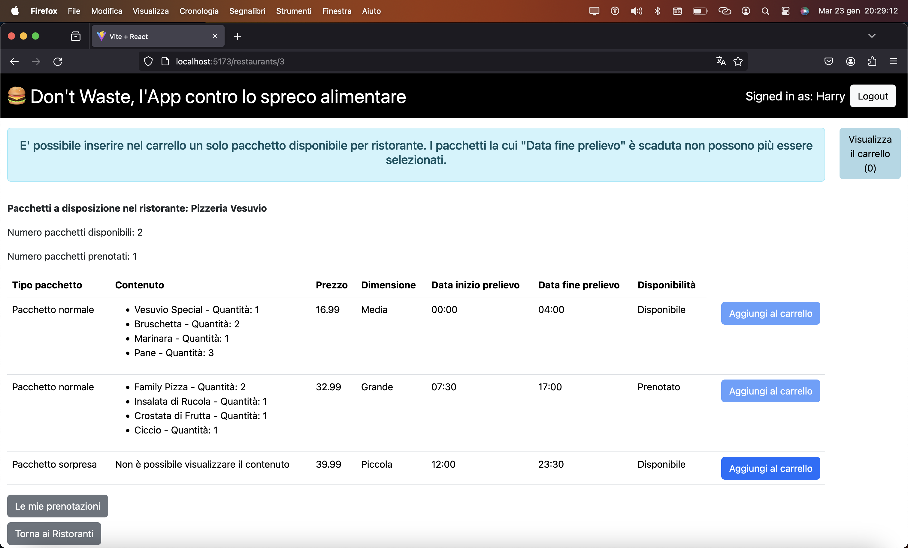
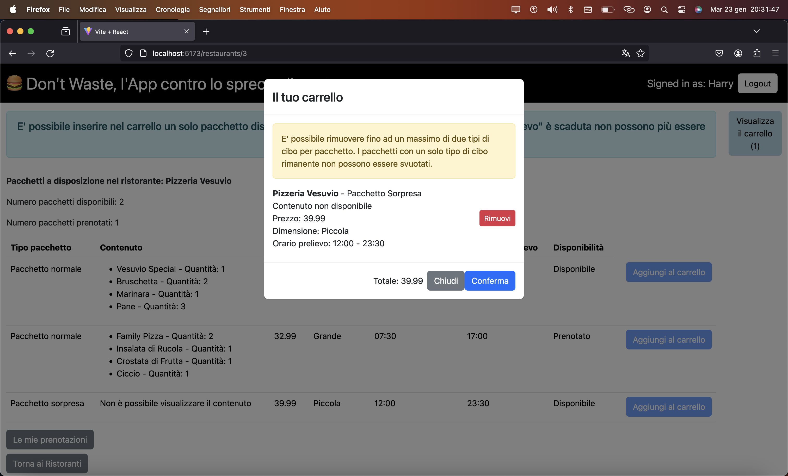

[](https://classroom.github.com/a/AoyUG5Y1)
# Exam #12345: "Food Recovery"
## Student: s310561 Marrone Pietro 

## React Client Application Routes

- Route `/`: main page, shows the complete list of restaurants upon arriving at the site
- Route `/restaurants/:resId`: page for viewing the packages of each restaurant
- Route `/bookings`: page for viewing a user's bookings
- Route `/login`: login page
- Route `*`: for non-existent pages

## API Server

### __1. List of Restaurants__

- URL: /api/restaurants

- Method: GET

- Authorization: authentication not required

- Description: Retrieve a list of all restaurants.

- Request Body: None

- Response:
  200 OK (success) or 404 Not Found (if no restaurants were found) or 500 Internal Server Error (generic error).

- Response Body: An array of objects, each describing a restaurant.
```
{
    "id": 1,
    "name": "Panificio del Gusto",
    "address": "Via del Pane 123",
    "phone_number": "+39 123 456 7890",
    "cuisine_type": "Italiana",
    "food_category": "Panificio",
}
```

### __2. List of a Restaurant's Packages__

- URL: /api/restaurants/:id/packages

- Method: GET

- Authorization: Authentication required

- Description: Retrieve a list of packages offered by the restaurant identified by id :id.

- Request Body: None

- Response:
  200 OK (success) or 404 Not Found (incorrect id) or 500 Internal Server Error (generic error) or 401 Unauthorized: the request is not from an authenticated session. 

- Response Body: An array of objects, each describing a package.
```
{
    "id": 1,
    "restaurant_id": "1",
    "restaurant_name": "Panificio del Gusto",
    "surprise_package": "0",

    "content": "[{"name": "Cornetto", "quantity": 2}, 
    {"name": "Cappuccino", "quantity": 1}, 
    {"name": "Macchiato", "quantity": 1}]",

    "price": "12.99",
    "size": "Piccola",
    "start_time": "2024-01-25 10:30:00",
    "end_time": "2024-01-25 17:00:00",
    "availability": "1",
}
```

### __3. List of a User's Bookings__

- URL: /api/bookings

- Method: GET

- Authorization: Authentication required

- Description: Retrieve a list of bookings made by the authenticated user.

- Request Body: None

- Response:
  - 200 OK (success) with an array of objects describing the user's bookings.
  - 404 Not Found
  - 500 Internal Server Error (generic error).
  - 401 Unauthorized: the request is not from an authenticated session.

- Response Body (Success Example): An array of objects, each describing a single booking. Each booking object consists of fields that are themselves arrays: "packages" is, for example, an array of objects, each describing a single package of that specific booking.
```
[
  {
    "id": 15,
    "user_id": 4,
    "package_ids": [1, 12, 8],
    "package_contents": [
      [
        {
            "name": "Dolce al Cioccolato",
            "quantity": 2
        },
        {
            "name": "Tiramisù",
            "quantity": 1
        }
      ],
      null], 

    "packages": [
      {
        "id": 1,
        "restaurant_id": 1,
        "restaurant_name": "Panificio del Gusto",
        "surprise_package": false,
        "price": 12.99,
        "size": "Piccola",
        "content": [{
            "name": "Dolce al Cioccolato",
            "quantity": 2},
        {   "name": "Tiramisù",
            "quantity": 1}],
        "start_time": "2024-01-25 10:30:00",
        "end_time": "2024-01-25 17:00:00",
        "availability": true
      },
      // Altri pacchetti...
    ]
  },
  // Altre prenotazioni...
]
```

- Response Body (No Bookings Example): An empty array indicating that the user has no bookings.
```
[]
```

### __4. Create Booking__

- URL: /api/bookings

- Method: POST

- Authorization: Authentication required

- Validation: Checks the validity of the request, returning any validation errors with status 422 Unprocessable Entity.
  - packageIds: Array of package IDs
  - packageContents: Array of package contents

- Description: Creates a new booking for the authenticated user, checking the availability of the specified packages. Returns the booking ID if creation is successful; otherwise, returns an array of IDs for the unavailable packages.

- Request Body: "packageIds", which is the list of package IDs included in the booking, and "package_contents", which is the list of package contents included in the booking (and modified in the cart).
```
{
   "packageIds": [1, 12, 8]
}

{
   "packageContents": [
      null, 
      [
        {
            "name": "Dolce al Cioccolato",
            "quantity": 2
        },
        {
            "name": "Tiramisù",
            "quantity": 1
        }
      ],
      null], 
}
```
- Response: 200 OK (success) with the booking ID, or 200 OK with an array of IDs for the unavailable packages.

- Response Body (Success Example): An object containing the booking ID if the booking was created successfully.
```
{
   15
}
```

- Response Body (Unavailable Packages Example): An array of package IDs that are unavailable.
```
{
   [1,3]
}
```

- Possible Errors:
  - 401 Unauthorized: The request is not from an authenticated session.
  - 422 Unprocessable Entity: The request is invalid.
  - 500 Internal Server Error: Generic error during booking creation.

### __5. Deleting a Booking__

- URL: /api/bookings/:id

- Method: DELETE

- Authorization: Authentication required

- Description: Deletes the booking identified by ID :id for the authenticated user.

- URL Parameters:
  - :id (required) - The ID of the booking to delete.

- Request Body: None

- Response:
  - 200 OK (success) with the number of rows affected by the deletion.
  - 401 Unauthorized: The request is not from an authenticated session.
  - 503 Service Unavailable: Database error during the booking deletion.

- Response Body (Success Example):
```
{
   1 
}
```


### __6. Create a New Session (Login)__

- URL: `/api/sessions`

- HTTP Method: POST

- Description: Create a new session using the provided credentials.

- Request Body:
```
{
  "username": "harry@test.com",
  "password": "pwd"
}
```

- Response: `200 OK` (success) or `500 Internal Server Error` (generic error).

- Response Body: _None_


### __7. Get the Current Session if it Exists__

- URL: `/api/sessions/current`

- HTTP Method: GET

- Description: Checks if the provided session is still valid and returns information about the authenticated user. A cookie with a VALID SESSION ID must be provided to obtain information about the authenticated user in the current session.

- Request Body: _None_

- Response: `201 Created` (success) or `401 Unauthorized` (error).

- Response Body: 
```
{
  "username": "harry@test.com",
  "id": 4,
  "name": "Harry"
}
```

### __8. Destroy the Current Session (Logout)__

- URL: `/api/sessions/current`

- HTTP Method: DELETE

- Description: Deletes the current session. A cookie with a VALID SESSION ID must be provided.

- Request Body: _None_

- Response: `200 OK` (success) or `500 Internal Server Error` (generic error).

- Response Body: _None_

## Database Tables

### 1. Table "users"

- **Description:** Represents the users of the application.
- **Fields:**
  - `id`: Unique identifier for the user (primary key).
  - `email`: User's email address.
  - `name`: User's name.
  - `salt`: Random string used for password encryption.
  - `hash`: Password hash.

### 2. Table "restaurants"

- **Description:** Contains information about restaurants.
- **Fields:**
  - `id`: Unique identifier for the restaurant (primary key).
  - `name`: Restaurant's name.
  - `address`: Restaurant's address.
  - `phone_number`: Restaurant's phone number.
  - `cuisine_type`: Type of cuisine offered by the restaurant.
  - `food_category`: Food category offered by the restaurant.

### 3. Table "packages"

- **Description:** Represents the packages offered by restaurants.
- **Fields:**
  - `id`: Unique identifier for the package (primary key).
  - `restaurant_id`: Identifier of the restaurant associated with the package.
  - `restaurant_name`: Name of the restaurant associated with the package.
  - `surprise_package`: Boolean field (0 for regular package, 1 for surprise package).
  - `content`: Description of the package contents.
  - `price`: Price of the package.
  - `size`: Size of the package (small/medium/large).
  - `start_time`: Start time for package pickup.
  - `end_time`: End time for package pickup.
  - `availability`: Boolean field (0 for unavailable, 1 for available).

### 4. Table "bookings"

- **Description:** Contains information about user bookings.
- **Fields:**
  - `id`: Unique identifier for the booking (primary key).
  - `user_id`: Identifier of the user associated with the booking.
  - `package_ids`: List of package identifiers included in the booking.
  - `package_contents`: List of package contents included in the booking (and modified in the cart).


## Main React Components

### 1. Component ResRow

- **Description:** Represents a row in the restaurant table.
- **Main Props:**
  - `e`: Object containing the restaurant's information.
- **Behavior:**
  - Displays the restaurant information in a table row.
  - Handles the click on the "Enter the Store!" button to show the available packages.

### 2. Component MainRestaurants

- **Description:** Shows the list of main restaurants.
- **Main Props:**
  - `restaurants`: List of restaurants to display.
  - `showBookings`: Function to show the bookings.
- **Behavior:**
  - Sorts the restaurants alphabetically.
  - Provides a table of restaurants with detailed information.
  - Allows viewing the available packages for each restaurant and navigating to the bookings screen.

### 3. Component PackagesList

- **Description:** Displays the list of available packages at a restaurant.
- **Main Props:**
  - `packages`: List of packages to display.
  - `showBookings`: Function to show bookings.
  - `addToCart`: Function to add a package to the cart.
  - `setShowCart`: Function to set the cart display state.
- **Behavior:**
  - Provides a table of packages with details and options to add them to the cart.

### 4. Component Cart

- **Description:** Displays the user's cart.
- **Props:**
  - `cartItems`: Items in the cart.
  - `showCart`: Cart display state.
  - `setShowCart`: Function to set the cart display state.
  - `removeFromCart`: Function to remove an item from the cart.
  - `updateCart`: Function to update the cart after modifying a single package's contents.
  - `handleConfirm`: Function to confirm the booking.
  - `highlightUnavailable`: Indicates whether to highlight unavailable items following a failed booking attempt.
- **Behavior:**
  - Displays details of the items in the cart.
  - Allows removing and updating items.

### 5. Component BookingsList

- **Description:** Shows the user's list of bookings.
- **Props:**
  - `bookings`: List of bookings to display.
  - `deleteBooking`: Function to delete a booking.

### 6. Component NavHeader

- **Description:** Navigation bar header.
- **Props:**
  - `user`: Information about the authenticated user.
  - `logout`: Function to perform logout.
- **Behavior:**
  - Displays the user's name and provides a button for logging out.


## Screenshot





## Users Credentials

- enrico@test.com, pwd 
  - Additional Info: 2 bookings already made, the first from Pizzeria Margherita with a surprise package, the second from Fruttivendo + Dolci tentazioni with 1 food item removed from each package.
- luigi@test.com, pwd 
  - Additional Info: 1 booking already made from Pizzeria Vesuvio, where 2 out of 4 food items were removed.
- alice@test.com, pwd 
- harry@test.com, pwd
  - Additional Info: Default authenticated user, has no bookings. Will see packages as unavailable either because they are booked (by Enrico and Luigi) or because the pickup time has expired.
- carol@test.com, pwd 
