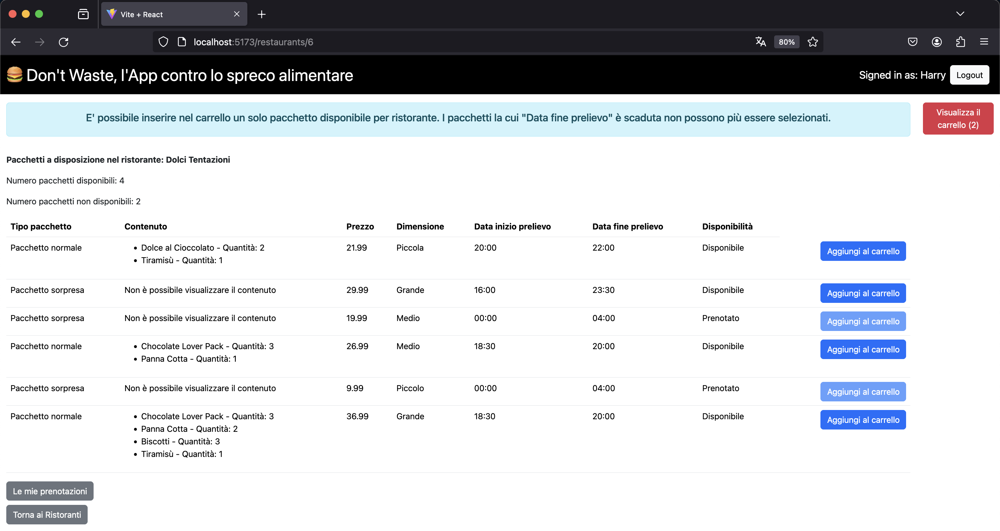

[](https://classroom.github.com/a/AoyUG5Y1)
# Exam #12345: "Recupero Cibo"
## Student: s310561 Marrone Pietro 

## React Client Application Routes

- Route `/`: pagina principale, mostra la lista completa dei ristoranti quando si arriva sul sito
- Route `/restaurants/:resId`: pagina per la visualizzazione dei pacchetti di ciascun ristorante
- Route `/bookings`: pagina per la visualizzazione delle prenotazioni di un utente
- Route `/login`: pagina per fare il login
- Route `*`: per le pagine che non esistono

## API Server


### __1. Elenco Ristoranti__

- URL: /api/restaurants

- Metodo: GET

- Autorizzazione: autenticazione non richiesta

- Descrizione: Ottieni un elenco di tutti i ristoranti.

- Corpo della Richiesta: Nessuno

- Risposta:
200 OK (successo) o 404 Not Found (se non sono stati trovati ristoranti) o 500 Errore Interno del Server (errore generico).

- Corpo della Risposta: Un array di oggetti, ognuno che descrive un ristorante.
```
{
    "id": 1,
    "name": "Panificio del Gusto",
    "address": "Via del Pane 123",
    "phone_number": "+39 123 456 7890",
    "cuisine_type": "Italiana",
    "food_category": "Panificio",
}
```

### __2. Elenco Pacchetti di un Ristorante__

- URL: /api/restaurants/:id/packages

- Metodo: GET

- Autorizzazione: Richiesta autenticazione

- Descrizione: Ottieni un elenco dei pacchetti offerti dal ristorante identificato dall'id :id.

- Corpo della Richiesta: Nessuno

- Risposta:
200 OK (successo) o 404 Not Found (id errato) o 500 Errore Interno del Server (errore generico) o 401 Unauthorized: la richiesta non arriva da una sessione autenticata. 

- Corpo della Risposta: Un array di oggetti, ognuno che descrive un pacchetto.
```
{
    "id": 1,
    "restaurant_id": "1",
    "restaurant_name": "Panificio del Gusto",
    "surprise_package": "0",

    "content": "[{"name": "Cornetto", "quantity": 2}, 
    {"name": "Cappuccino", "quantity": 1}, 
    {"name": "Macchiato", "quantity": 1}]",

    "price": "12.99",
    "size": "Piccola",
    "start_time": "2024-01-25 10:30:00",
    "end_time": "2024-01-25 17:00:00",
    "availability": "1",
}
```

### __3. Elenco Prenotazioni di un utente__

- URL: /api/bookings

- Metodo: GET

- Autorizzazione: Richiesta autenticazione

- Descrizione: Ottieni un elenco delle prenotazioni effettuate dall'utente autenticato.

- Corpo della Richiesta: Nessuno

- Risposta:
  - 200 OK (successo) con un array di oggetti che descrivono le prenotazioni dell'utente.
  - 404 Not Found 
  - 500 Errore Interno del Server (errore generico).

- Corpo della Risposta (Esempio Successo):
```
[
  {
    "id": 15,
    "user_id": 4,
    "package_ids": [1, 12, 8],
    "packages": [
      {
        "id": 1,
        "restaurant_id": 1,
        "restaurant_name": "Panificio del Gusto",
        "surprise_package": false,
        "price": 12.99,
        "size": "Piccola",
        "start_time": "2024-01-25 10:30:00",
        "end_time": "2024-01-25 17:00:00",
        "availability": true
      },
      // Altri pacchetti...
    ]
  },
  // Altre prenotazioni...
]
```

- Corpo della Risposta (Esempio Nessuna Prenotazione):
```
[]
```

- Errori Possibili:
   - 401 Unauthorized: L'autenticazione dell'utente non è valida.
   - 500 Internal Server Error: Errore generico durante il recupero delle prenotazioni dell'utente.

### __4. Crea Prenotazione__

- URL: /api/bookings

- Metodo: POST

- Autorizzazione: Richiesta autenticazione

- Validazione: Controlla la validità della richiesta, ritornando eventuali errori di validazione con status 422 Unprocessable Entity.
packageIds: Array di ID dei pacchetti

- Descrizione: Crea una nuova prenotazione per l'utente autenticato, verificando la disponibilità dei pacchetti specificati. Restituisce l'ID della prenotazione se la creazione è avvenuta con successo, altrimenti restituisce un array con gli ID dei pacchetti non disponibili.

- Corpo della Richiesta: Un oggetto che rappresenta una prenotazione (Content-Type: application/json).
```
{
   "packageIds": [1, 12, 8]
}
```
- Risposta: 200 OK (successo) con l'ID della prenotazione oppure 200 OK con un array di ID dei pacchetti non disponibili.

- Corpo della Risposta (Esempio Sucesso):
```
{
   15
}
```

- Corpo della Risposta (Esempio Pacchetti Non Disponibili):
```
{
   [1,3]
}
```

- Errori Possibili: 
  - 401 Unauthorized: L'autenticazione dell'utente non è valida. 
  - 422 Unprocessable Entity: La richiesta non è valida. 
  - 500 Internal Server Error: Errore generico durante la creazione della prenotazione.

### __5. Eliminazione di una prenotazione__

- URL: /api/bookings/:id

- Metodo: DELETE

- Autorizzazione: Richiesta autenticazione

- Descrizione: Elimina la prenotazione identificata dall'ID :id per l'utente autenticato.

- Parametri dell'URL:
   - :id (obbligatorio) - L'ID della prenotazione da eliminare.
   
- Corpo della Richiesta: Nessuno

- Risposta:
   - 200 OK (successo) con il numero di righe interessate dalla cancellazione.
   - 401 Unauthorized: L'autenticazione dell'utente non è valida.
   - 503 Service Unavailable: Errore del database durante l'eliminazione della prenotazione.

- Corpo della Risposta (Esempio Successo):
```
{
   1 
}
```

- Corpo della Risposta (Esempio Errore del Database):
```
{
  "error": "Database error during the deletion of booking :id."
}

```

### __6. Creare una nuova sessione (login)__

- URL: `/api/sessions`

- Metodo HTTP: POST

- Descrizione: Creare una nuova sessione partendo da credenziali fornite.

- Request body:
```
{
  "username": "harry@test.com",
  "password": "pwd"
}
```

- Response: `200 OK` (success) oo `500 Internal Server Error` (generic error).

- Response body: _None_


### __7. Ottieni la sessione corrente se esiste__

- URL: `/api/sessions/current`

- HTTP Method: GET

- Descrizione: Verifica se la sessione fornita è ancora valida e restituisce le informazioni sull'utente autenticato. Deve essere fornito un cookie con un VALIDO ID SESSIONE per ottenere le informazioni dell'utente autenticato nella sessione corrente.

- Request body: _None_ 

- Response: `201 Created` (success) o `401 Unauthorized` (error).

- Response body:
```
{
  "username": "harry@test.com",
  "id": 4,
  "name": "Harry"
}
```

### __8. Destroy the current session (logout)__

- URL: `/api/sessions/current`

- HTTP Method: DELETE

- Descrizione: Elimina la sessione corrente. Deve essere fornito un cookie con un VALIDO ID SESSIONE.

- Request body: _None_

- Response: `200 OK` (success) o `500 Internal Server Error` (generic error).

- Response body: _None_

## Database Tables

### 1. Tabella "users"

- **Descrizione:** Rappresenta gli utenti dell'applicazione.
- **Campi:**
  - `id`: Identificativo univoco dell'utente.
  - `email`: Indirizzo email dell'utente.
  - `name`: Nome dell'utente.
  - `salt`: Stringa casuale utilizzata per la crittografia delle password.
  - `hash`: Hash della password.

### 2. Tabella "restaurants"

- **Descrizione:** Contiene informazioni sui ristoranti.
- **Campi:**
  - `id`: Identificativo univoco del ristorante.
  - `name`: Nome del ristorante.
  - `address`: Indirizzo del ristorante.
  - `phone_number`: Numero di telefono del ristorante.
  - `cuisine_type`: Tipo di cucina offerta dal ristorante.
  - `food_category`: Categoria di cibo offerta dal ristorante.

### 3. Tabella "packages"

- **Descrizione:** Rappresenta i pacchetti offerti dai ristoranti.
- **Campi:**
  - `id`: Identificativo univoco del pacchetto.
  - `restaurant_id`: Identificativo del ristorante associato al pacchetto.
  - `restaurant_name`: Nome del ristorante associato al pacchetto.
  - `surprise_package`: Campo booleano (0 per pacchetto normale, 1 per pacchetto sorpresa).
  - `content`: Descrizione del contenuto del pacchetto.
  - `price`: Prezzo del pacchetto.
  - `size`: Dimensione del pacchetto.
  - `start_time`: Ora di inizio prelievo del pacchetto.
  - `end_time`: Ora di fine prelievo del pacchetto.
  - `availability`: Campo booleano (0 per non disponibile, 1 per disponibile).

### 4. Tabella "bookings"

- **Descrizione:** Contiene informazioni sulle prenotazioni degli utenti.
- **Campi:**
  - `id`: Identificativo univoco della prenotazione.
  - `user_id`: Identificativo dell'utente associato alla prenotazione.
  - `package_ids`: Elenco degli identificativi dei pacchetti inclusi nella prenotazione.


## Main React Components

### 1. Componente ResRow

- **Descrizione:** Rappresenta una riga della tabella dei ristoranti.
- **Proprietà principali:**
  - `e`: Oggetto contenente le informazioni del ristorante.
- **Comportamento:**
  - Visualizza le informazioni del ristorante in una riga della tabella.
  - Gestisce il click sul pulsante "Entra nel negozio!" per mostrare i pacchetti disponibili.

### 2. Componente MainRestaurants

- **Descrizione:** Mostra la lista dei ristoranti principali.
- **Proprietà principali:**
  - `restaurants`: Lista dei ristoranti da visualizzare.
  - `showBookings`: Funzione per mostrare le prenotazioni.
- **Comportamento:**
  - Ordina i ristoranti in ordine alfabetico.
  - Fornisce una tabella interattiva di ristoranti con informazioni dettagliate.
  - Permette di visualizzare i pacchetti disponibili per ogni ristorante e di entrare nella schermata delle prenotazioni.

### 3. Componente PackagesList

- **Descrizione:** Mostra la lista dei pacchetti disponibili in un ristorante.
- **Proprietà principali:**
  - `packages`: Lista dei pacchetti da visualizzare.
  - `showBookings`: Funzione per mostrare le prenotazioni.
  - `addToCart`: Funzione per aggiungere un pacchetto al carrello.
  - `setShowCart`: Funzione per impostare lo stato del display del carrello.
- **Comportamento:**
  - Fornisce una tabella di pacchetti con dettagli e opzioni per aggiungerli al carrello.

### 4. Componente Cart

- **Descrizione:** Visualizza il carrello dell'utente.
- **Proprietà:**
  - `cartItems`: Elementi nel carrello.
  - `showCart`: Stato del display del carrello.
  - `setShowCart`: Funzione per impostare lo stato del display del carrello.
  - `removeFromCart`: Funzione per rimuovere un elemento dal carrello.
  - `updateCart`: Funzione per aggiornare il carrello dopo aver modificato il contenuto di un singolo pacchetto.
  - `handleConfirm`: Funzione per confermare la prenotazione.
  - `highlightUnavailable`: Indica se evidenziare gli elementi non disponibili a seguito di una prenotazione andata a male.
- **Comportamento:**
  - Visualizza i dettagli degli elementi nel carrello.
  - Permette la rimozione e l'aggiornamento degli elementi.

### 5. Componente BookingsList

- **Descrizione:** Mostra l'elenco delle prenotazioni dell'utente.
- **Proprietà:**
  - `bookings`: Lista delle prenotazioni da visualizzare.
  - `deleteBooking`: Funzione per eliminare una prenotazione

### 6. Componente NavHeader

- **Descrizione:** Intestazione della barra di navigazione.
- **Proprietà:**
  - `user`: Informazioni sull'utente autenticato.
  - `logout`: Funzione per effettuare il logout.
- **Comportamento:**
  - Visualizza il nome dell'utente e fornisce un pulsante per il logout.


## Screenshot



## Users Credentials

- enrico@test.com, pwd (plus any other requested info)
- luigi@test.com, pwd (plus any other requested info)
- alice@test.com, pwd (plus any other requested info)
- harry@test.com, pwd (plus any other requested info)
- carol@test.com, pwd (plus any other requested info)

